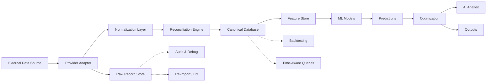
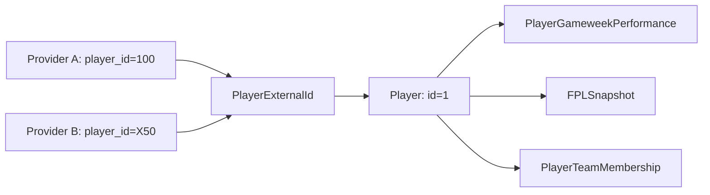

# Data Lineage

This document explains the data flow from raw source to final database record, and how each stage supports future features.

## Data Flow



## Stage Details

### 1. RAW SOURCE

The external data source. Examples:
- Official FPL API (`https://fantasy.premierleague.com/api/`)
- Understat (expected goals data)
- FBref (comprehensive match statistics)
- Football-data.org (fixtures and results)

**Output**: Provider-specific JSON/CSV/XML with provider-specific schemas.

### 2. PROVIDER ADAPTER

Each external source has an adapter implementing the `HistoricalFootballDataProvider` protocol.

**Responsibility**:
- Fetch data from the external source
- Handle authentication, rate limiting, retries
- Return data in a documented format for the normalization layer

**Output**: Provider-specific `Mapping[str, object]` dictionaries.

#### Stage 1C provider decision path

Production ingestion resolves FPL through `ProviderRegistry` and then calls
`FplProviderAdapter`. The adapter owns the legacy synchronous provider shape,
cache-first lookup, and provider budget accounting; `FplEgressChain` remains an
allowed internal fetch strategy for async FPL endpoints. Higher-level services
must not construct `OfficialFPLDataProvider` or choose an egress strategy.

The remaining direct `FplEgressChain` constructions are endpoint-specific
internal fetches (live gameweek data, squad/history, fixtures, planner, and
transfer services). They are retained to preserve their existing async egress
fallback behavior and should be moved behind an async registry adapter in a
later foundation stage. `OfficialFPLDataProvider` remains only as the legacy
sync implementation wrapped by the ingestion adapter; it is no longer imported
by ingestion orchestration, CLI, or admin orchestration.

### 3. RAW RECORD STORE

Before any transformation, the raw payload is saved to the `raw_records` table.

**Fields**:
- `source`: Which provider/adapter fetched this data
- `provider`: Provider name
- `endpoint`: API endpoint or dataset identifier
- `retrieved_at`: When we fetched it (UTC)
- `payload_hash`: SHA-256 hash for deduplication
- `payload`: Complete raw JSON payload
- `season_code`: Season this data belongs to

**Purpose**:
- Audit trail: we can always see exactly what the source provided
- Debugging: if canonical data looks wrong, we can inspect the raw data
- Re-import: if we fix a normalization bug, we can re-process without re-fetching
- Evidence: raw data is the ground truth; canonical data is derived

### 4. NORMALIZATION LAYER

The `domain/canonical.py` module converts provider-specific schemas into provider-independent canonical entities.

**Key design**:
- Each `normalize_*` function handles one entity type
- Supports multiple schema versions (v1, v2) via a `schema_version` parameter
- Missing or null fields are handled gracefully
- Type coercion (string → int, string → datetime) is centralized

**Example**:
```python
# Provider A (v1)
{"provider_team_id": "1", "name": "Arsenal", "short_name": "ARS"}

# Provider B (v2)
{"team_id": "A_1", "full_name": "Arsenal", "abbreviation": "ARS"}

# Both normalize to:
{"provider_team_id": "1", "name": "Arsenal", "short_name": "ARS"}
```

### 5. RECONCILIATION ENGINE

The `ingestion/reconciliation.py` module validates data quality before persistence.

**Checks performed**:
- Every entity has a valid provider ID
- Fixtures reference known teams
- No duplicate fixture IDs
- Player statistics reference known players and fixtures
- Minutes are within valid range (0-120)
- Scores are non-negative
- Gameweeks are within valid range (1-38)

**Output**: `ReconciliationReport` with:
- Records received, accepted, rejected
- Unmatched entities
- Duplicate candidates
- Warnings and critical errors

### 6. CANONICAL DATABASE

The PostgreSQL database with the canonical schema.

**Key tables**:
- `seasons`: Season metadata
- `teams`: Canonical team identities
- `team_external_ids`: Provider → team mapping
- `players`: Canonical player identities
- `player_external_ids`: Provider → player mapping
- `player_team_memberships`: Player-team relationships with temporal validity
- `gameweeks`: Gameweek definitions with deadlines
- `fixtures`: Match fixtures with scores and status
- `player_match_performances`: Per-match player statistics
- `player_gameweek_performances`: Gameweek-level player aggregates
- `team_match_performances`: Per-match team statistics
- `fpl_snapshots`: Time-aware FPL data snapshots
- `ingestion_runs`: Import tracking for idempotency
- `raw_records`: Raw source data preservation

### 7. FUTURE: FEATURE STORE

The next milestone will build a time-aware feature store on top of the canonical database.

**Features will include**:
- Rolling averages (form, points per game)
- Fixture difficulty ratings
- Team strength metrics
- Player expected metrics
- Price change predictions
- Ownership trends

### 8. FUTURE: ML MODELS

Models will consume features from the feature store.

**Planned models**:
- Player points prediction
- Minutes prediction
- Expected goals/assists
- Clean sheet probability
- Price change prediction

### 9. FUTURE: PREDICTIONS

Model outputs will be stored as predictions with confidence intervals.

### 10. FUTURE: OPTIMIZATION

Optimization algorithms will consume predictions:

- **Transfer optimization**: Best transfers for upcoming gameweeks
- **Captain optimization**: Best captain choice each gameweek
- **Chip optimization**: When to use wildcard, free hit, etc.
- **Monte Carlo simulation**: Simulate season outcomes

### 11. FUTURE: AI ANALYST

An AI layer that can answer natural language questions about:
- Team performance
- Player recommendations
- Transfer strategies
- Historical analysis

## Backtesting Support

The data lineage is designed to support strict no-look-ahead backtesting:

```
Backtest Query: "What did the system know before Gameweek 10 of 2024-25?"

1. Query fpl_snapshots WHERE event_time < Gameweek 10 deadline
2. Query player_gameweek_performances WHERE gameweek < 10
3. Query fixtures WHERE kickoff_time < Gameweek 10 deadline
4. Query raw_records WHERE retrieved_at < Gameweek 10 deadline
```

This ensures that backtesting uses only information that was available at the time, preventing look-ahead bias.

## Entity Resolution Flow



Multiple provider IDs resolve to a single canonical player. All performance data, snapshots, and memberships reference the canonical player ID.