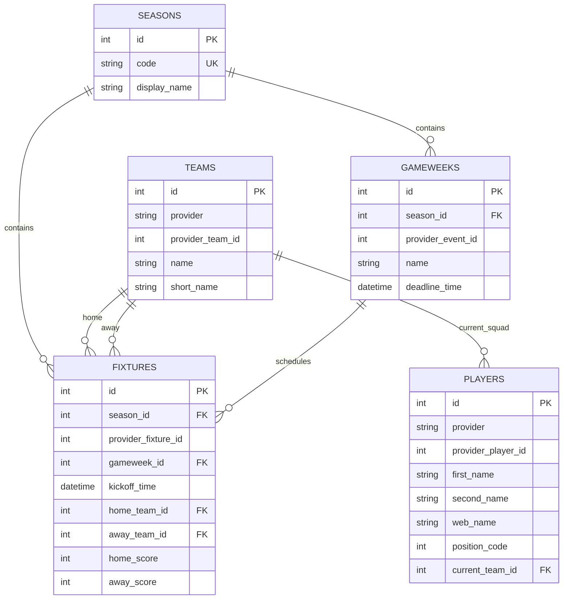

# Database

```mermaid
erDiagram
    SEASONS ||--o{ GAMEWEEKS : contains
    SEASONS ||--o{ FIXTURES : contains
    TEAMS ||--o{ PLAYERS : current_squad
    TEAMS ||--o{ FIXTURES : home
    TEAMS ||--o{ FIXTURES : away
    GAMEWEEKS ||--o{ FIXTURES : schedules

    SEASONS {
      int id PK
      string code UK
      string display_name
    }
    TEAMS {
      int id PK
      string provider
      int provider_team_id
      string name
      string short_name
    }
    PLAYERS {
      int id PK
      string provider
      int provider_player_id
      string first_name
      string second_name
      string web_name
      int position_code
      int current_team_id FK
    }
    GAMEWEEKS {
      int id PK
      int season_id FK
      int provider_event_id
      string name
      datetime deadline_time
    }
    FIXTURES {
      int id PK
      int season_id FK
      int provider_fixture_id
      int gameweek_id FK
      datetime kickoff_time
      int home_team_id FK
      int away_team_id FK
      int home_score
      int away_score
    }
```
